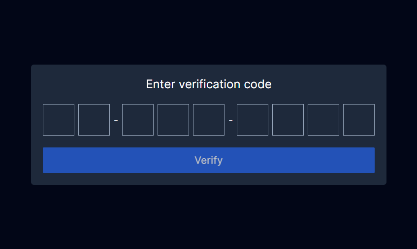

# OTP Input Component

The OTP Input Component is a React component designed for entering and verifying OTP codes. It's a solution for a job recruitment task.

## Props

- **OTPStructure** (`(number | string)[]`): Specifies the structure of the OTP input. It is an array containing numbers (indicating the number of input fields) and strings (representing separators).

  For example

  ```tsx
  <OTP OTPStructure={[2, "-", 3, "-", 4]} />
  ```

  will result with

  

- **autoFocus** (`boolean`, optional, default: `true`): Determines whether the first input field should be autofocused upon component mount.

## Features

- **Structured Input**: Define the structure of the OTP input using numbers and separators.
- **Input Validation**: Only accepts digit characters as input.
- **Automatic Focus**: Automatically focuses the next input field upon entering a digit.
- **Paste Functionality**: Allows users to paste OTP codes, ignoring non-digit characters and handling excess digits intelligently.

## Getting Started

First, run the development server:

```bash
npm run dev
# or
yarn dev
# or
pnpm dev
# or
bun dev
```

Open [http://localhost:3000](http://localhost:3000) with your browser to see the result.

You can start editing the page by modifying `app/page.tsx`. The page auto-updates as you edit the file.

This project uses [`next/font`](https://nextjs.org/docs/basic-features/font-optimization) to automatically optimize and load Inter, a custom Google Font.

## Learn More

To learn more about Next.js, take a look at the following resources:

- [Next.js Documentation](https://nextjs.org/docs) - learn about Next.js features and API.
- [Learn Next.js](https://nextjs.org/learn) - an interactive Next.js tutorial.

You can check out [the Next.js GitHub repository](https://github.com/vercel/next.js/) - your feedback and contributions are welcome!

## Deploy on Vercel

The easiest way to deploy your Next.js app is to use the [Vercel Platform](https://vercel.com/new?utm_medium=default-template&filter=next.js&utm_source=create-next-app&utm_campaign=create-next-app-readme) from the creators of Next.js.

Check out our [Next.js deployment documentation](https://nextjs.org/docs/deployment) for more details.
